# Nexus3私库环境搭建(maven,docker,npm,yum,apt)

Nexus全称Sonatype Nexus，是一种特殊的远程仓库，它是架在局域网内的仓库服务。可以用于局域网中的 [docker](https://so.csdn.net/so/search?q=docker&spm=1001.2101.3001.7020)、maven、npm、yum 等私服代理，并且支持私有仓库。

Nexus3是一个仓库管理器，它极大地简化了本地内部仓库的维护和外部仓库的访问,平常我们在获取maven仓库资源的时候，都是从maven的官方（或者国内的镜像）获取，但假如你的生产环境的服务器无互联网访问权限，此时需要在局域网一个有互联网访问权限的服务器上搭建一个私有的仓库，这样其他有互联网访问权限的服务器可以通过已搭建的私库仓库来下载安装如Maven、apt、yum、gradle、pypi、docker等等，就像是直接通过互联网下载一样。

**Nexus支持：**
Nexus在代理远程仓库的同时维护本地仓库，以降低中央仓库的负荷,节省外网带宽和时间，Nexus私服就可以满足这样的需要。
Nexus是一套“开箱即用”的系统不需要数据库，它使用文件系统加Lucene来组织数据。
Nexus支持WebDAV与LDAP安全身份认证。
Nexus还提供了强大的仓库管理功能，构件搜索功能，基于REST，占用较少的内存，基于简单文件系统而非数据库。


这里以 Ubuntu 20.04.3 LTS 为例，进行Nexus部署和私服配置， 其他Liunx 系统操作步骤大体一致 。

本文安装操作不适用 Window 系统 ，不解释。


### 一、环境准备

nexus3是由Java开发的,需要先安装好Jdk

```shell
#ubuntu
apt install  openjdk-17-jdk-headless

##centos 系统使用下面这个命令
yum install java-1.8.0-openjdk-headless.x86_64

#PS：安装多个版本jdk可以使用命令配置 update-alternatives --config java 

```

### 二、nexus软件安装

以安装nexus-3.29为例，准备好nexus-3.29.1-01-unix.tar.gz

下载地址： https://help.sonatype.com/repomanager3/product-information/download

```shell
mkdir /opt/nexus3
wget -c https://download.sonatype.com/nexus/3/nexus-3.40.1-01-unix.tar.gz
tar -xvf nexus-3.29.1-01-unix.tar.gz -C /opt/nexus3
#结果如下，其中nexus-3.40.1-01为程序，sonatype-work为数据目录
drwxr-xr-x 10 root root 4.0K Jul  2 16:30 nexus-3.40.1-01/
drwxr-xr-x  3 root root 4.0K Jul  2 16:31 sonatype-work/
```

### 三、配置修改与启动 nexus

+ Nexus默认的端口是8081，可以在etc/nexus-default.properties配置中修改 

+ nexus-context-path修改 ，可以在 /etc/nexus-default.properties 配置中修改

```properties
application-port=8081
nexus-context-path=/nexus3
```

+ JVM相关的配置在 bin/nexus.vmoptions

1. 比如内存比较少，则调整下VM参数，参考值如

> -Xms500M
> -Xmx500M
> -XX:MaxDirectMemorySize=800M

+ 默认的存储目录在安装目录下的nexus-3.29.1-01，比如要修改这个到别处，则修改nexus.vmoptions中的karaf.data，karaf.log，java.io.tmpdir等值

> -Dkaraf.data=…/sonatype-work/nexus3
> -Dkaraf.log=…/sonatype-work/nexus3/log
> -Djava.io.tmpdir=…/sonatype-work/nexus3/tmp 

**启动服务**

```shell
cd /opt/nexus3/nexus-3.40.1-01/bin
./nexus start 启动
./nexus stop  停止
./nexus status 查看启动状态
```

### 四、访问8081端口

+ Nexus默认的端口是8081，可以在etc/nexus-default.properties配置中修改。

+ Nexus默认的用户名密码是admin/admin123  (新版本)

+ 当遇到奇怪问题时，重启nexus，启动时间会比较慢 要1分钟左右后才能访问。

+ Nexus的工作目录是sonatype-work（路径一般在nexus同级目录下）


### 五、配置 maven 仓库

> maven默认仓库
>
> maven-central：maven中央库，默认从https://repo1.maven.org/maven2/拉取jar
> maven-releases：私库发行版jar
> maven-snapshots：私库快照（调试版本）jar
> maven-public：仓库分组，把上面三个仓库组合在一起对外提供服务，在本地maven基础配置settings.xml中使用。
> nexus仓库类型主要分为三种
>
> proxy 远程代理仓库jar放置的目录
> hosted 本地仓库jar放置的目录,我们一般部署自己的jar到这个类型的仓库
> group远程代理仓库jar和本机仓库jar


#### 5.1  配置maven-aliyun代理

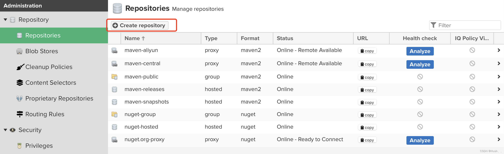

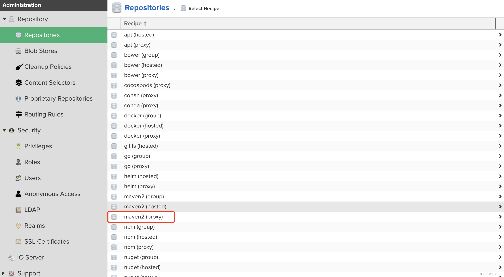

> **注：注意需要点击 View certificate** 

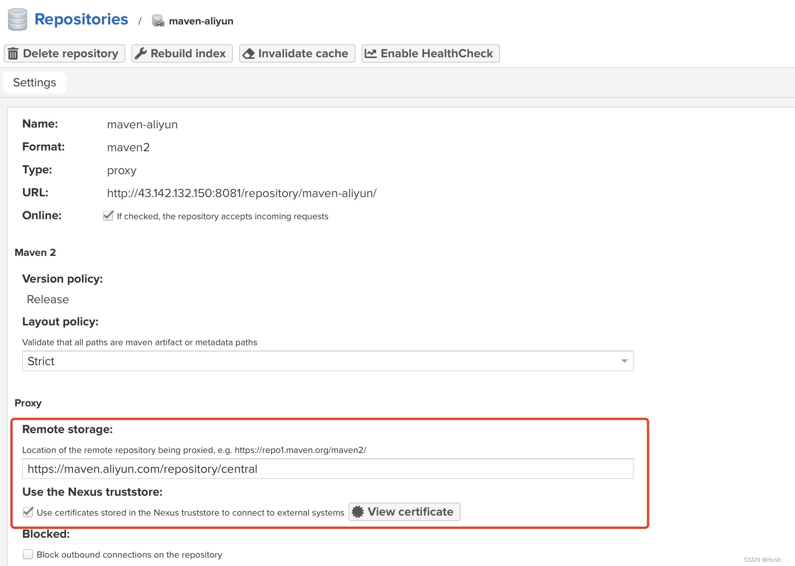

https://maven.aliyun.com/repository/central


#### 5.2 将aliyun仓库添加到maven-public仓库组，并调整顺序

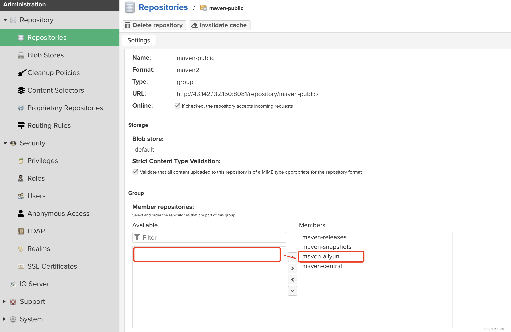


#### 5.3 修改本地maven配置

本地没有安装 maven 的先按照 maven

```shell
apt install mvn
#或者手动下载安装
wget http://mirrors.tuna.tsinghua.edu.cn/apache/maven/maven-3/3.6.3/binaries/apache-maven-3.6.3-bin.tar.gz
```

打开本地的maven下的conf/settings.xml

1、加入servers ， 您的私服账户和密码，确保有权限 

```xml
 <servers>
    <server>
      <id>maven-releases</id>
      <username>用户名</username>
      <password>密码</password>
    </server>
    <server>
      <id>maven-snapshots</id>
      <username>用户名</username>
      <password>密码</password>
    </server>
  </servers>
```

2、配置私服地址

```xml
<mirror>
  <id>maven-central</id>
  <mirrorOf>*</mirrorOf>
  <name>my maven resp</name>
  <url>http://ip:端口/repository/maven-public/</url>
</mirror>
```

查看方法

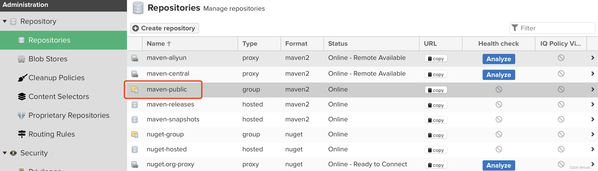


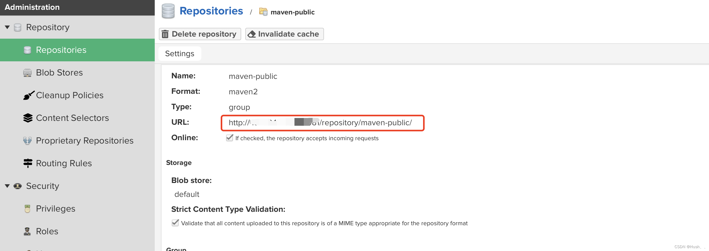


#### 5.4 项目pom文件更改

1.从私服下载jar包依赖

```xml
<!--    从私有服务器下载jar包-->
<repositories>
        <repository>
            <id>local-repository</id>
            <url>http://ip:端口/repository/maven-public/</url>
            <releases>
                <enabled>true</enabled>
            </releases>
            <snapshots>
                <enabled>true</enabled>
            </snapshots>
        </repository>
    </repositories>
```

2.上传jar包到私服的依赖

```xml
<!--    向私有仓库服务器上传jar包-->
    <distributionManagement>
        <repository>
            <id>maven-releases</id>
            <url>http://ip:端口/repository/maven-releases/</url>
        </repository>
        <snapshotRepository>
            <id>maven-snapshots</id>
            <url>http://ip:端口/repository/maven-snapshots/</url>
        </snapshotRepository>
    </distributionManagement>
```

#### 5.5 将maven项目打包到私服

```
mvn clean deploy
```

#### 5.6 查看包依赖 

选中需要依赖的包，并点击

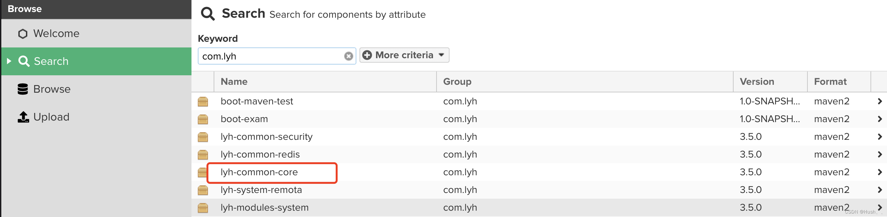

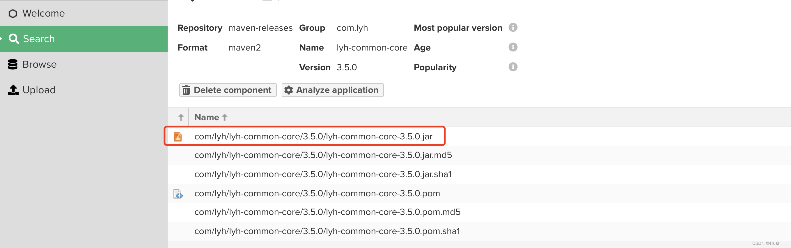

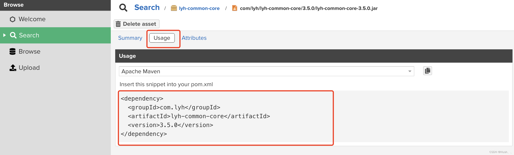

将此依赖引入到项目中即可。

注：引入私服仓库需要引入 五、中导入私服包到pom配置 


### 六、配置 docker 私有、代理 仓库

在 Nexus3 中对于docker 的支持又 hosted（自托管私有仓库）、proxy（代理）、group（聚合）三种模式，其中 group 模式可以将多个模式集中成一个地址访问，比如使用 hosted 模式搭建私有的 docker 仓库，一些项目中的镜像都上传到这个地方。使用 proxy 模式代理远程的仓库比如 dockerHub ，可以在局域网中下载外网的镜像。此时就可以通过 group 默认将hosted模式和proxy模式聚合成一个地址访问，这样在下载镜像的时候如果是私服的镜像直接在私服拉取了，如果没有再通过代理拉取远程的镜像。

下面开始搭建上面的模式：

#### 6.1 首先我们先创建三个 Blob Stores ，分别存放三种模式产生的文件：  

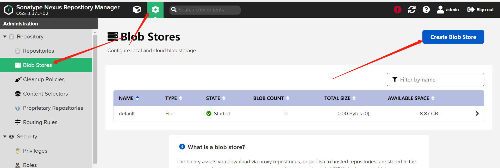 


创建 docker-hosted

 


同样操作，再创建 docker-proxy , docker-group ,创建完成后在列表中可以看到

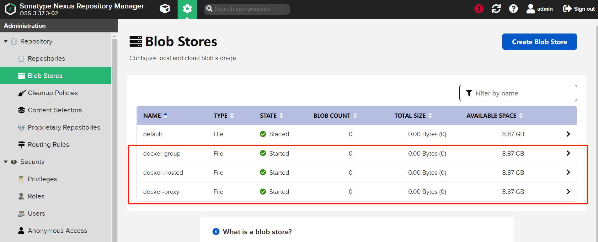  


#### 6.2 下面开始创建 hosted 模式私服仓库
点击当前页的 Repositories ，然后点击 左上角的 Create repositories：

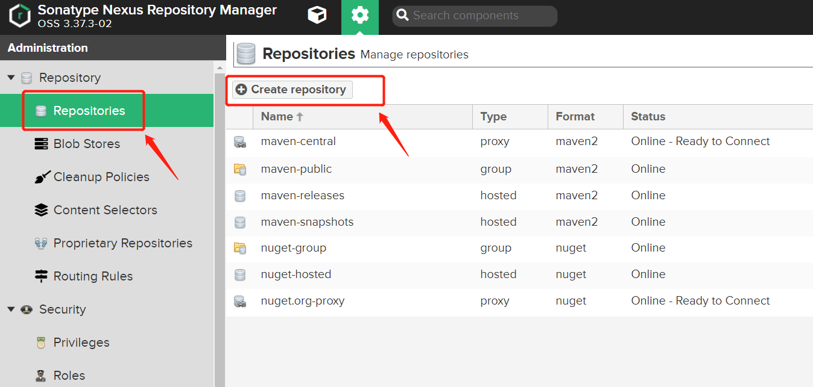 

选中 docker(hosted) 模式：

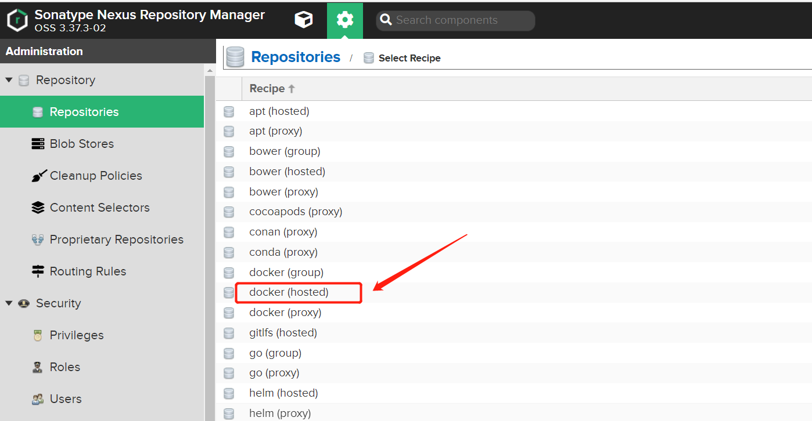 

指定基本信息及配置：

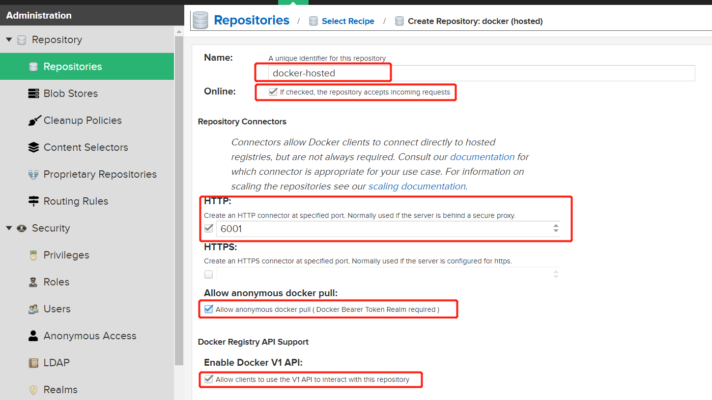 

其中开放协议使用的 HTTP，端口就是上面安装时候释放的 6001 ，下面 Blob store 选择上面创建的：

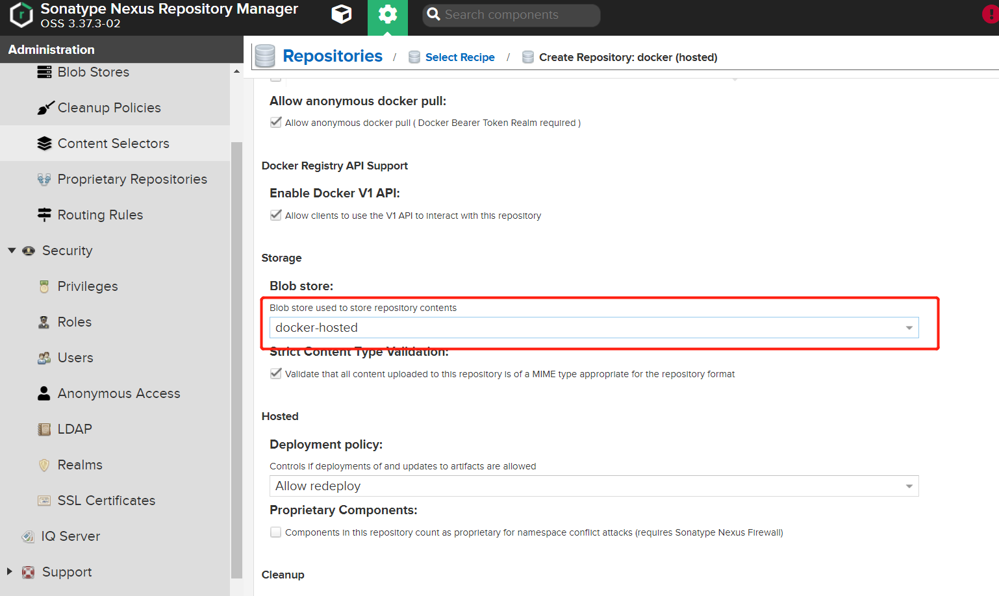 


最后点击最下面的 Create repositories完成创建。


####6.3 接着创建 proxy 模式代理仓库
选中 docker(proxy)，代理模式可以不用开放协议端口，因为后面拉取镜像统一使用 group 模式进行拉取：

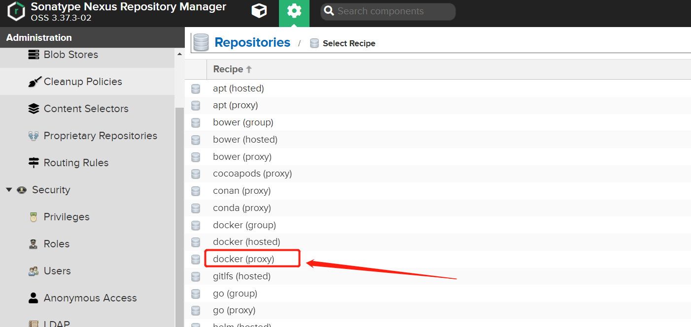 

同样填写信息：

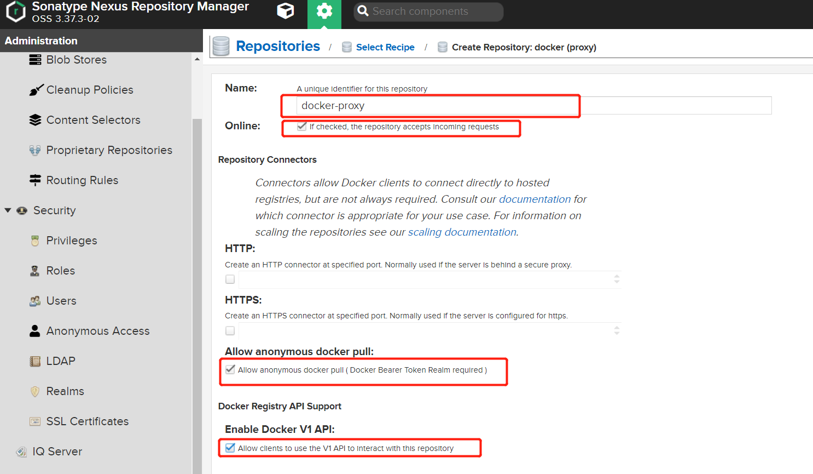 

下面需要填写一个代理地址，可以指定为：https://registry-1.docker.io  下面 Docker Index 可以使用 Docker Hub 的：

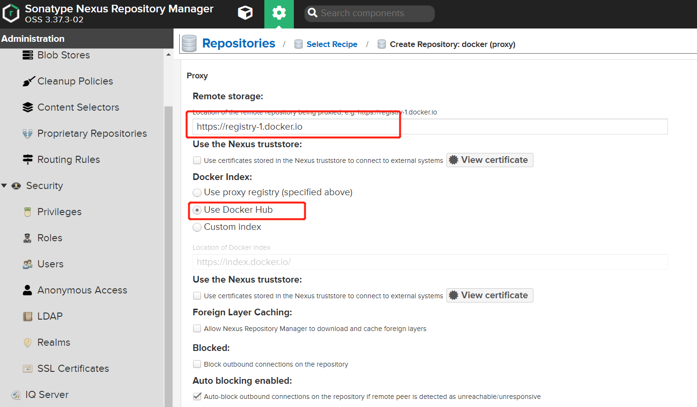 

下面 Blob store 同样使用上面创建的：


最后点击最下面的 Create repositories完成创建。

#### 6.3 接着创建 group 模式代理仓库
选中 docker(group)：

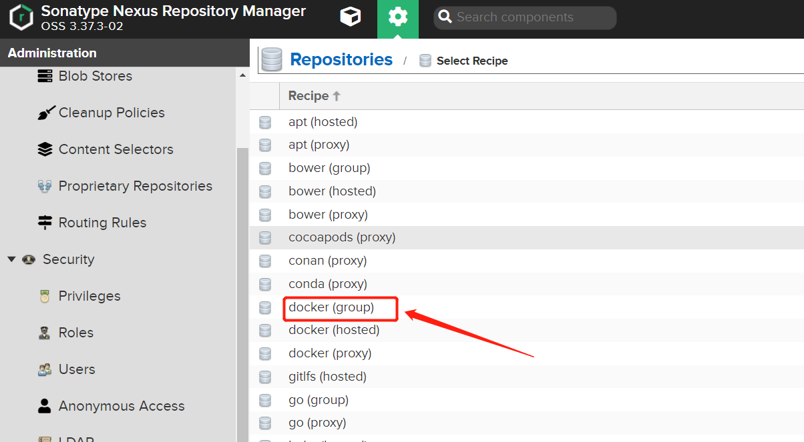 

同样填写信息，注意端口需要使用 6000 了：

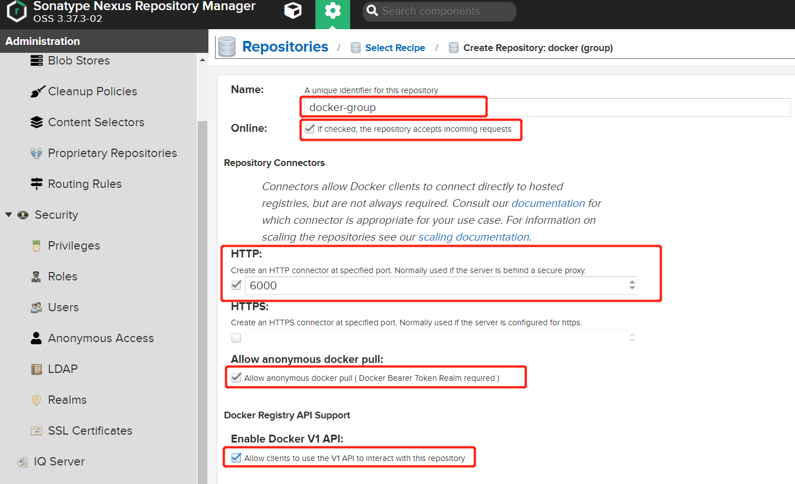 

下面 Blob store 同样使用上面创建的，注意下面的 group 需要选中上面创建好的两种模式：

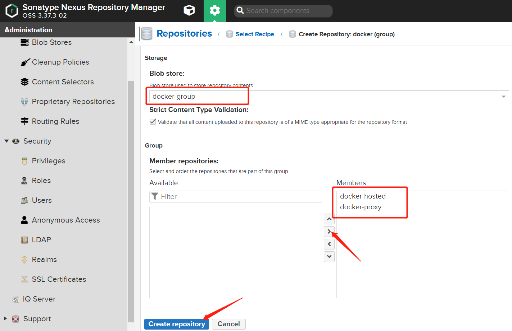 


最后点击最下面的 Create repositories完成创建。

到这就已经创建好三种模式了，可以在列表中看到创建的仓库：

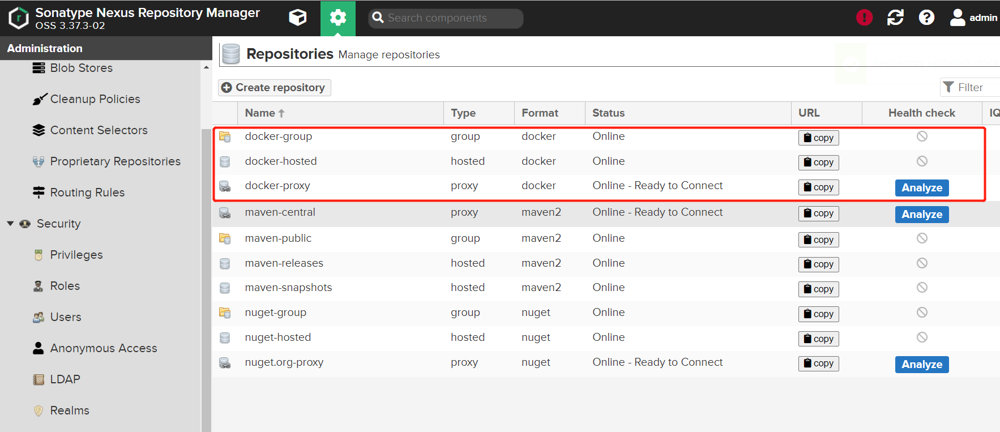 

下面就可以在 docker 客户端指定仓库为上面创建的仓库了，下面继续测试一下。

#### 6.5 docker 客户端测试
修改 /etc/docker/daemon.json 文件，在 insecure-registries 中，增加私有配置：

```json
{
  "registry-mirrors": [
  		"https://你的阿里云id.mirror.aliyuncs.com"
   ],
  "insecure-registries": [
    "192.168.40.171:6000",
    "192.168.40.171:6001"
   ]
}
```

重启 docker：

```shell
systemctl restart docker
```

登录 私服仓库：

```shell
docker login -u admin -p nexus 192.168.40.171:6000
docker login -u admin -p nexus 192.168.40.171:6001
```

此时如果报 failed with status: 401 Unauthorized 异常：

这个是没有使用 SSL证书和域名，需要修改下 Realms 中的配置：

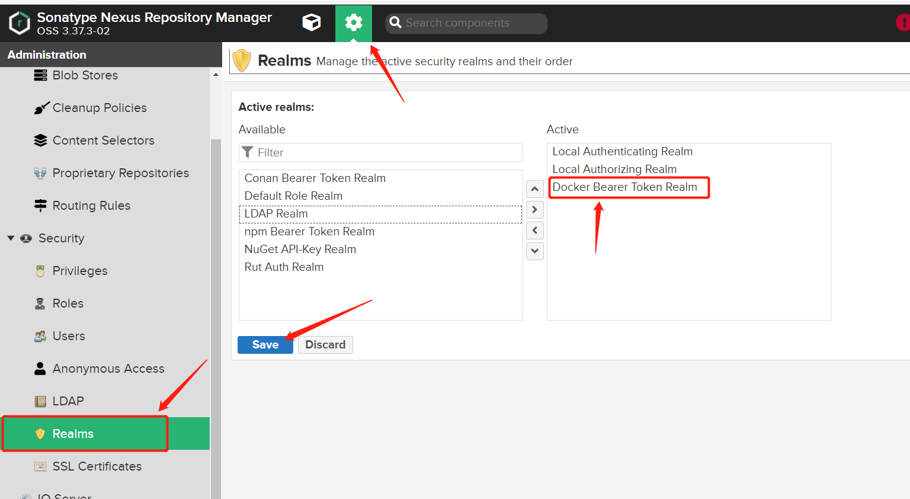 


下面再进行登录就可以了：


拉取镜像
```shell
docker pull 192.168.40.171:6000/nginx
```

可以看到已经拉取到镜像，可以在 nexus3 的 web 页面看到该镜像：


上传镜像
首先标记镜像并更换个名称方便看到效果

```
docker tag 192.168.40.171:6000/nginx:latest 192.168.40.171:6001/test/nginxbxc:latest
```

推送镜像

```
docker push 192.168.40.171:6001/test/nginxbxc:latest
```

查看 web 页面：

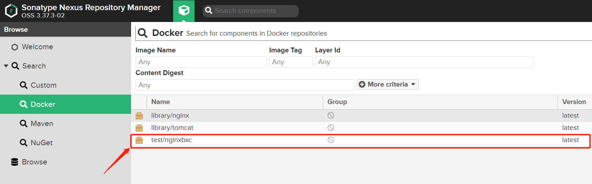 


### 七、配置yum 源

#### 7.1 选择一个自己常用的镜像源。比如使用阿里的镜像源。

- 阿里开源镜像源：https://mirrors.aliyun.com/centos/
- 网易开源镜像站：https://mirrors.163.com/centos/
- Centos社区镜像站 http://mirror.centos.org/centos/
- 中科大开源镜像站：http://centos.ustc.edu.cn/
- 清华开源软件镜像站：https://mirrors.tuna.tsinghua.edu.cn/centos/


####7.2 在nexus上进行以下配置:

+ 先创建一个Blob Stores.

 


- 创建Repositories

点击设置 - -> Repositories -- > Create repository --> yum(proxy)进入到以下界面。

然后在第四步的那里输入需要代理的镜像源，第五步就是选择上面所创建的Storage.

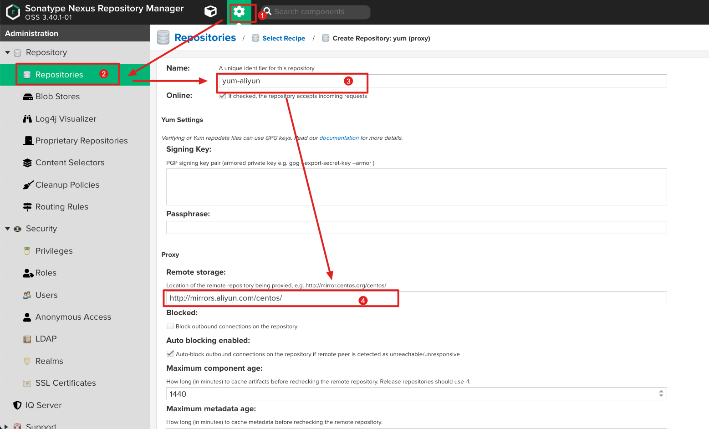 

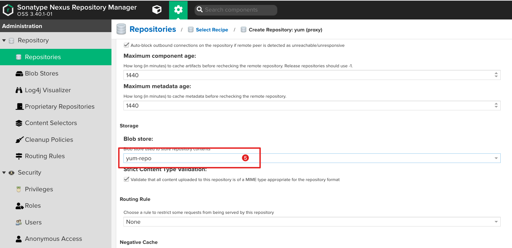 


- 复制代理连接

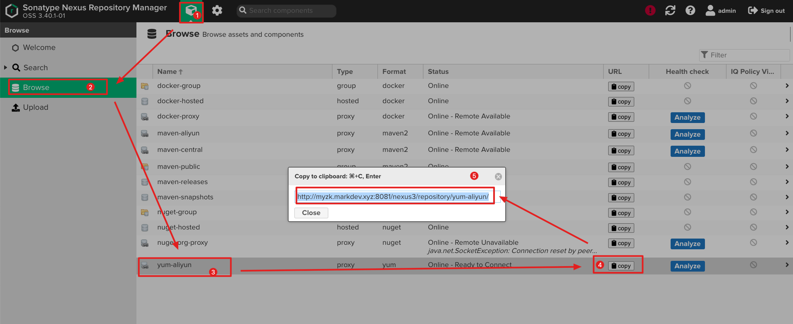 


#### 7.3 目标机器上配置yum源

- 登录到机器

以下针对的是centos的操作系统

进入/etc/yum.repos.d/

- 备份好*.repo的文件

```bash
# mv CentOS-Base.repo CentOS-Base.repo.bakeup
```

在nexus上面复制刚刚创建yum仓库的链接  http://myzk.markdev.xyz:8081/nexus3/repository/yum-aliyun/

- 修改CentOS-Base.repo文件

```bash
# CentOS-Base.repo
#
# The mirror system uses the connecting IP address of the client and the
# update status of each mirror to pick mirrors that are updated to and
# geographically close to the client.  You should use this for CentOS updates
# unless you are manually picking other mirrors.
#
# If the mirrorlist= does not work for you, as a fall back you can try the
# remarked out baseurl= line instead.
#
#

[base]
name=CentOS-$releasever - Base
# mirrorlist=http://myzk.markdev.xyz:8081/nexus3/repository/yum-aliyun/?release=$releasever&arch=$basearch&repo=os&infra=$infra
baseurl=http://mirrors.baidubce.com/centos/$releasever/os/$basearch/
gpgcheck=1
gpgkey=file:///etc/pki/rpm-gpg/RPM-GPG-KEY-CentOS-7

#released updates
[updates]
name=CentOS-$releasever - Updates
# mirrorlist=http://myzk.markdev.xyz:8081/nexus3/repository/yum-aliyun/?release=$releasever&arch=$basearch&repo=updates&infra=$infra
baseurl=http://mirrors.baidubce.com/centos/$releasever/updates/$basearch/
gpgcheck=1
gpgkey=file:///etc/pki/rpm-gpg/RPM-GPG-KEY-CentOS-7

#additional packages that may be useful
[extras]
name=CentOS-$releasever - Extras
# mirrorlist=http://myzk.markdev.xyz:8081/nexus3/repository/yum-aliyun/?release=$releasever&arch=$basearch&repo=extras&infra=$infra
baseurl=http://mirrors.baidubce.com/centos/$releasever/extras/$basearch/
gpgcheck=1
gpgkey=file:///etc/pki/rpm-gpg/RPM-GPG-KEY-CentOS-7

#additional packages that extend functionality of existing packages
[centosplus]
name=CentOS-$releasever - Plus
# mirrorlist=http://myzk.markdev.xyz:8081/nexus3/repository/yum-aliyun/?release=$releasever&arch=$basearch&repo=centosplus&infra=$infra
baseurl=http://mirrors.baidubce.com/centos/$releasever/centosplus/$basearch/
gpgcheck=1
enabled=0
gpgkey=file:///etc/pki/rpm-gpg/RPM-GPG-KEY-CentOS-7
```

- 清理缓存

```bash
$ yum clean all 
$ yum makecache
```

如果不报错就可以了


### 八、配置 apt 源

#### 8.1择一个自己常用的镜像源。比如使用阿里的镜像源。

这里也是以阿里云的apt源为例。 源地址: http://mirrors.aliyun.com/ubuntu


#### 8.2 在nexus上进行以下配置:

Nexus配置过程同yum 源配置，可以参考【七、配置 yum 源】


#### 8.3 目标机器上配置apt源

以下针对的是ubuntu的操作系统

进入/etc/apt

- 备份旧的yum源

```bash
$ sudo mv sources.list sources.list.bak
```

- 编辑sources.list文件

复制代理连接过来：http://your-nexus.com/repository/alicoud-apt-repo/

```bash
deb http://myzk.markdev.xyz:8081/nexus3/repository/apt-aliyun/ focal main restricted universe multiverse
deb-src http://myzk.markdev.xyz:8081/nexus3/repository/apt-aliyun/ focal main restricted universe multiverse
deb http://myzk.markdev.xyz:8081/nexus3/repository/apt-aliyun/ focal-security main restricted universe multiverse
deb-src http://myzk.markdev.xyz:8081/nexus3/repository/apt-aliyun/ focal-security main restricted universe multiverse
deb http://myzk.markdev.xyz:8081/nexus3/repository/apt-aliyun/ focal-updates main restricted universe multiverse
deb-src http://myzk.markdev.xyz:8081/nexus3/repository/apt-aliyun/ focal-updates main restricted universe multiverse
deb http://myzk.markdev.xyz:8081/nexus3/repository/apt-aliyun/ focal-proposed main restricted universe multiverse
deb-src http://myzk.markdev.xyz:8081/nexus3/repository/apt-aliyun/ focal-proposed main restricted universe multiverse
deb http://myzk.markdev.xyz:8081/nexus3/repository/apt-aliyun/ focal-backports main restricted universe multiverse
deb-src http://myzk.markdev.xyz:8081/nexus3/repository/apt-aliyun/ focal-backports main restricted universe multiverse
```

- 更新源

```bash
$ apt-get update
```


#### 九、配置NPM 私服代理

> npm仓库类型
>
> + npm(proxy): 可配置代理的仓库，当此仓库没有相应包时 会从配置的第三方仓库拉取 并缓存到本地proxy仓库
> + npm(hosted)：开发自己的包推送到此仓库，需登录才能推送
> + npm(group)： 可配置包含上面两种仓库，这样用户只需要配置npm(group) 这个地址即可 ，避免配置npm(proxy) 和npm(hosted) 两个地址


#### 7.1 首先我们先创建三个 Blob Stores ，分别存放三种模式产生的文件：  

 


创建 npm-hosted 

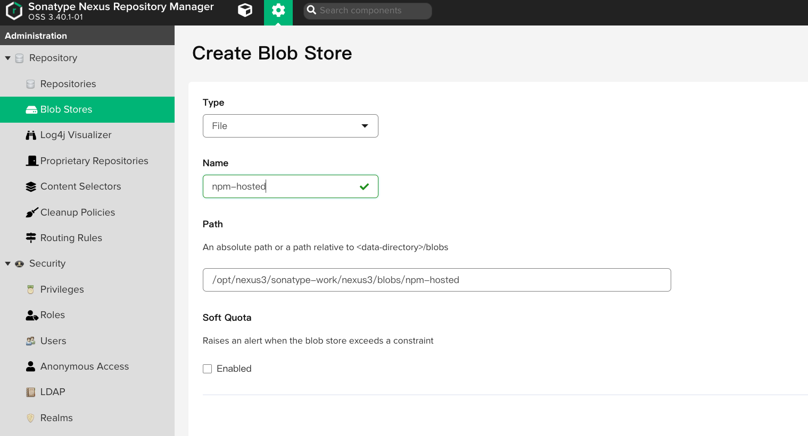 


同样操作创建 npm-proxy,npm-group  ，创建完成后在列表中可以看到

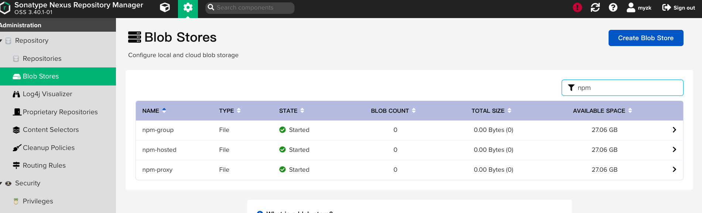

  

#### 8.2 创建 hosted 模式私服仓库

点击当前页的 Repositories ，然后点击 左上角的 Create repositories：

 

选中 npm(hosted) 模式：

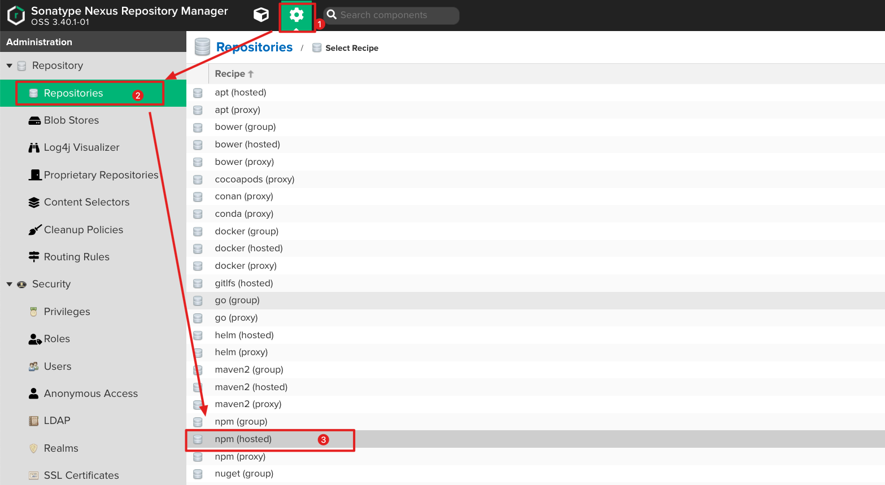  

指定基本信息及配置：

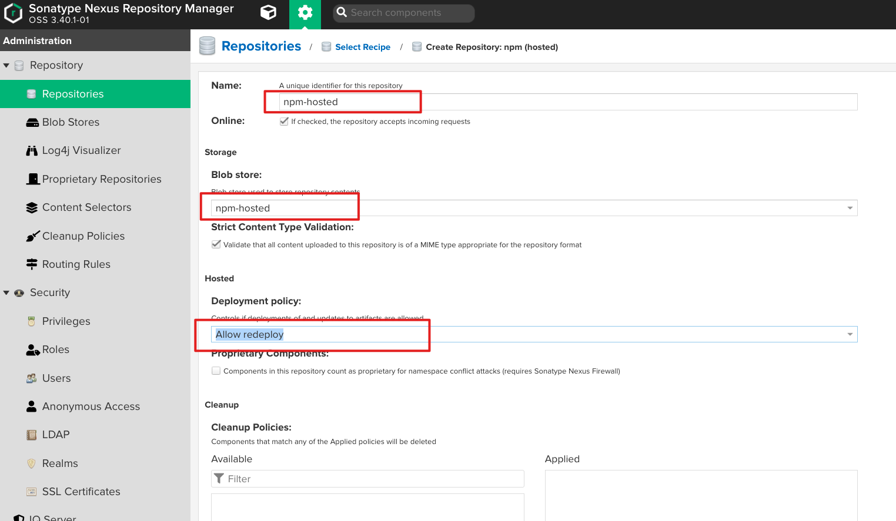  

Deployment Policy ： 建议选择 Allow redploy 这个选项，因为实际项目中开发会经常推送同一个包上去，如果选择Disable redeploy 则在仓库有 xx 文件时

最后点击最下面的 Create repositories完成创建。


#### 8.3 接着创建 proxy 模式代理仓库
选中 npm(proxy)，同样填写信息：

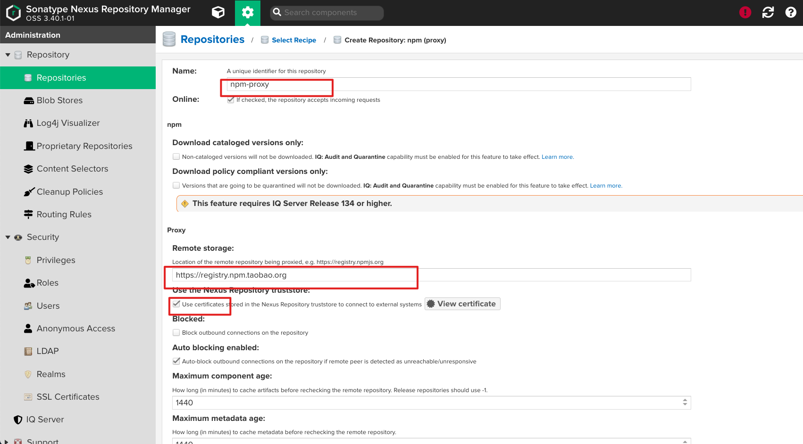 

 

配置淘宝源为远程仓库地址 https://registry.npm.taobao.org 当proxy仓库没有包时 会去淘宝拉取并缓存本地


最后点击最下面的 Create repositories完成创建。


#### 8.3 接着创建 group 模式代理仓库

选中 npm(group)：同样填写信息

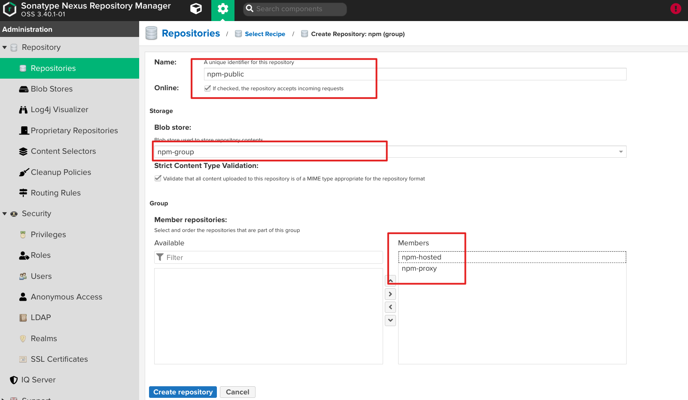  

下面 Blob store 同样使用上面创建的，注意下面的 group 需要选中上面创建好的两种模式：

 最后点击最下面的 Create repositories完成创建。

到这就已经创建好三种模式了，可以在列表中看到创建的仓库：

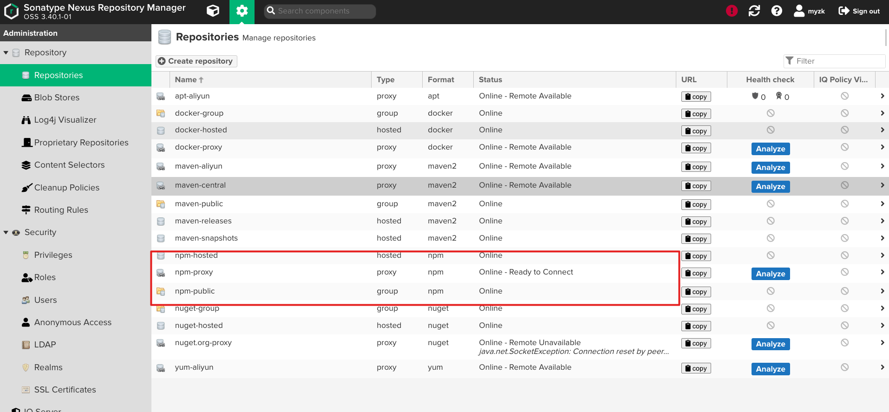

 

#### 8.4 测试nexus 仓库

1. 在使用nexus前 仓库没有任何数据

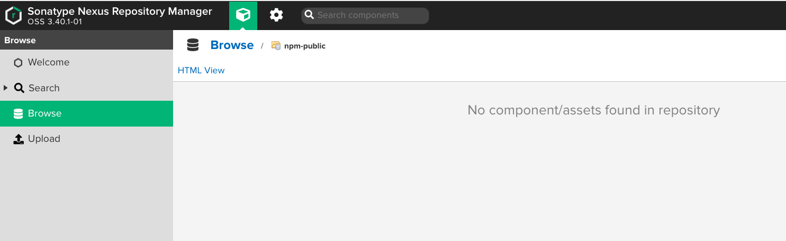


2. 自定义项目构建 ，寻找自己的jenkins或其他项目进行构建
+ 创建一个测试项目

```shell
mkdir /home/nodeJsDemo
vi index.js #写入下面 js 内容
```

index.js

```js
const express = require('express')
const port = 3000

const app = express()

app.get('/', function (req, res) {
  res.send('<h1>Hello World!</h1>');
})

app.listen(port)
console.log("Server Listen on port: " +  port)
```

+ 构建项目 

```shell
#构建时指定nexus 镜像仓库
npm config set registry http://myzk.markdev.xyz:8081/nexus3/repository/npm-public/ #配置使用nexus仓库代理 
npm -loglevel info install express    #-loglevel info 能打印出拉取包的地址 用于测试构建是否使用nexus代理 npm run build:prod
```

+ 通过日志可以看出 ，node构建已经走了配置的nexus代理

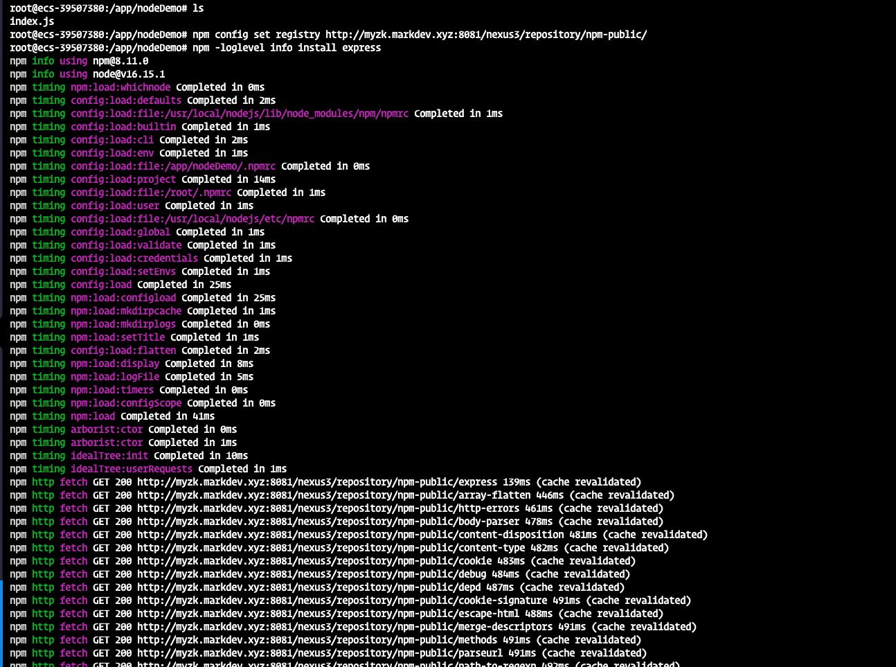 


+ 查看nexus仓库，查看是否缓存的拉取的响应的node包

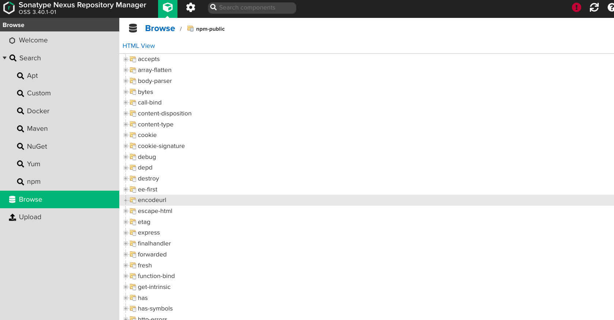 


 可以看出 nexus 已经将流水线构建需要的包 拉倒了本地并缓存

 node 项目使用vue时 会安装依赖node-sass 而node-saas 有需要去github上下载依赖包， 当网络不稳定时，就会出现下载超时，甚至是失败的情况，最显著现象就是流水线构建极慢，开发抱怨颇深，我们可以建node-saa 类型的包也做个nexus代理

注： VUE工程使用了node-sass或其它命令工具，仅仅只对[淘宝 NPM 镜像](https://links.jianshu.com/go?to=https%3A%2F%2Fregistry.npm.taobao.org%2F)进行代理是不行的，我们还需要对[淘宝开源镜像](https://links.jianshu.com/go?to=http%3A%2F%2Fnpm.taobao.org%2Fmirrors)进行代理。

**解决办法：**

+ 方法1. 可直接配置淘宝代理 ：npm config set sass_binary_site [https://npm.taobao.org/mirrors/node-sass/](https://links.jianshu.com/go?to=https%3A%2F%2Fnpm.taobao.org%2Fmirrors%2Fnode-sass%2F)

+ 方法2. 使用nexus group代理，然后将group 远程仓库设置为淘宝，这样比直接设置淘宝代理更快

  

#### 8.5 附：配置nexus raw仓库

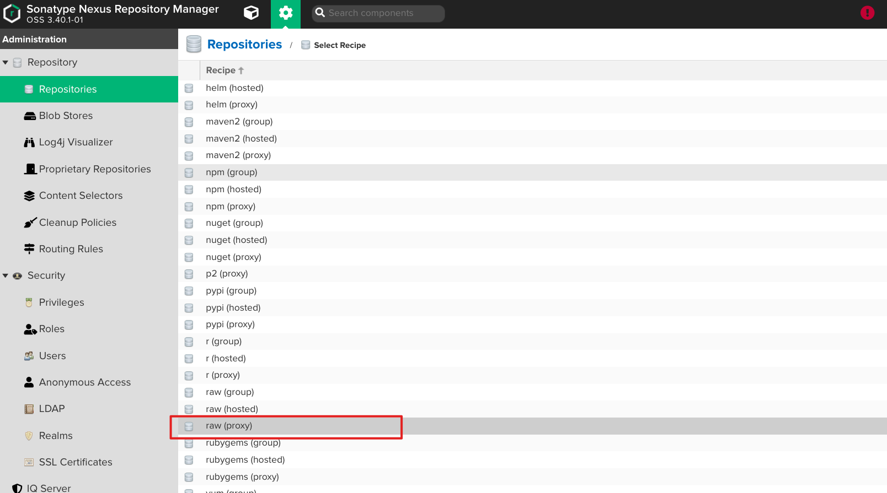

填写远程代理地址：https://npm.taobao.org/mirrors/node-sass

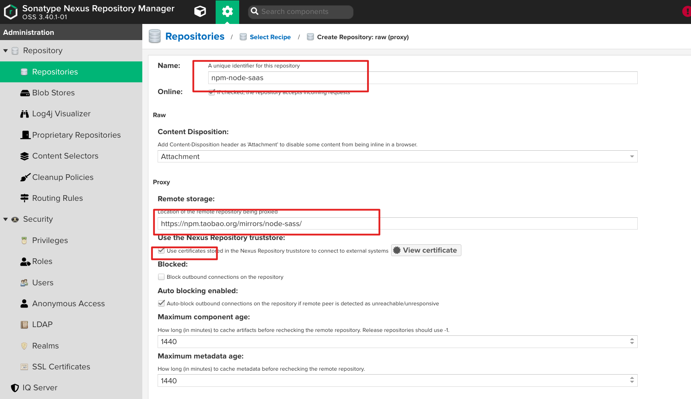

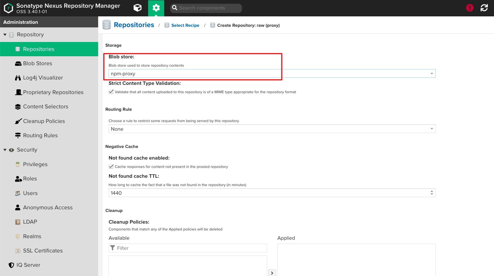 


+ 测试，在使用前 仓库没有任何数据

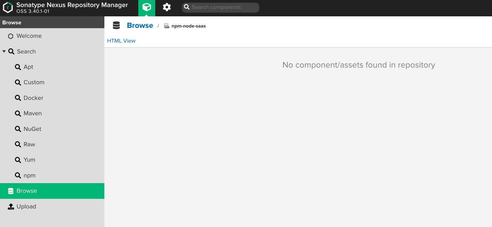 


+ 构建

```shell
npm config set registry http://myzk.markdev.xyz:8081/nexus3/repository/npm-public/
npm config set sass_binary_site http://myzk.markdev.xyz:8081/nexus3/repository/npm-node-saas/

#在项目文件夹下安装node-sass
npm -loglevel info install --save-dev node-sass
```


+ 通过构建日志可以看出，已经走了 nexus 代理

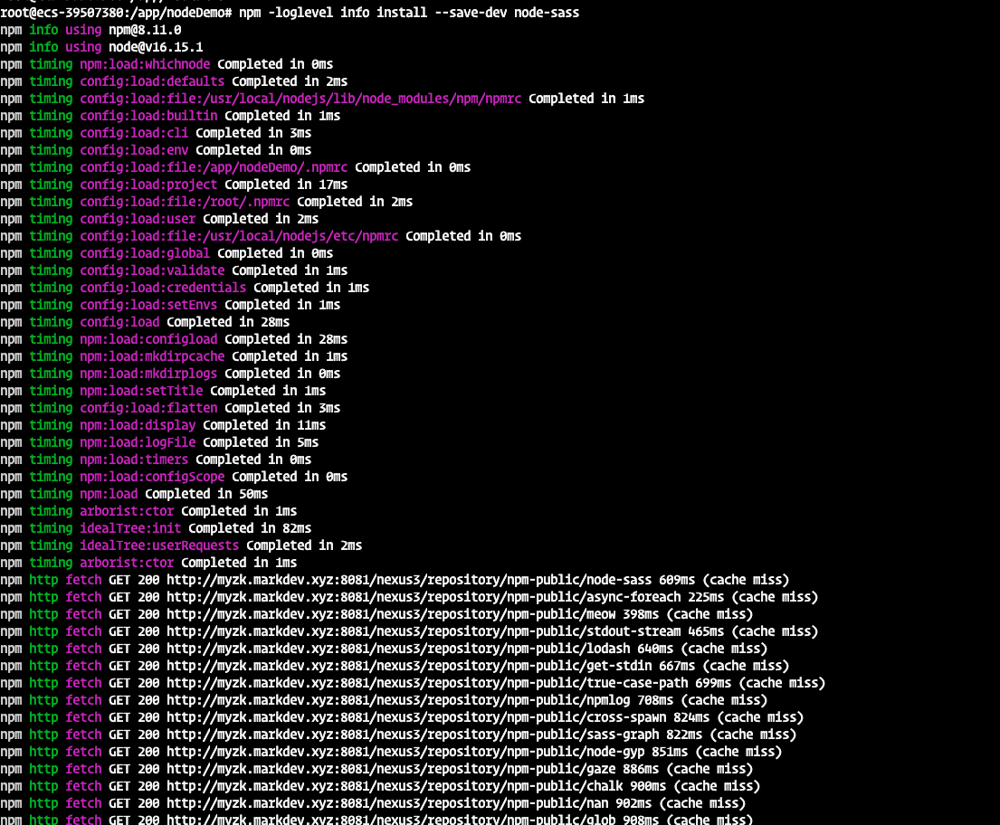 


+ 查看 npm-node-saas仓库，已经缓存了 node-saas的资源包

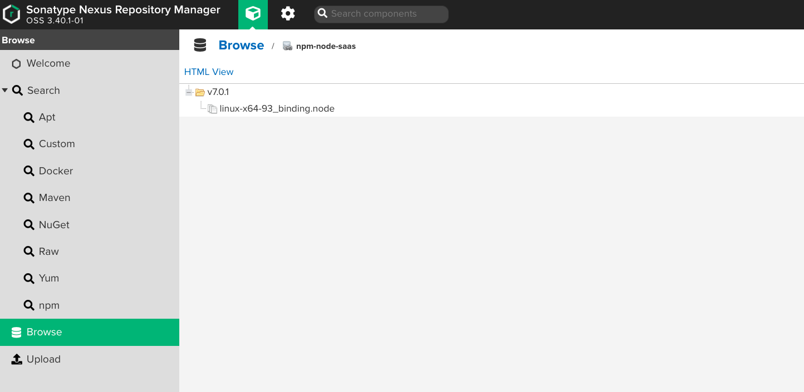 


